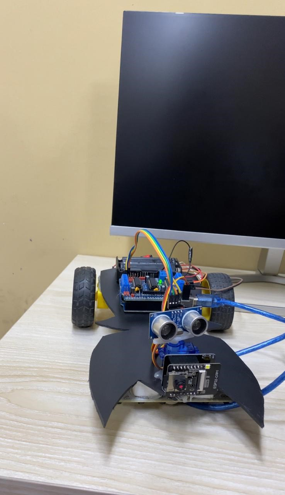

# 🧠 Microprocessor-Lab  
### A project based on **B.O.D (Batwave Object Detective Car)**  

  

---

## 🚗 Project Overview

The **Batwave Object Detective Car (B.O.D.)** is a robotic vehicle that combines **line-following navigation**, **object detection**, and **CCTV-style surveillance**.  
It follows a marked path using an **IR sensor array**, detects obstacles with **ultrasonic sensors**, and identifies human presence with a **PIR sensor**.  

When detection occurs, it triggers alerts through a **buzzer**, **LEDs**, and a **laser pointer**.  
A **camera module (ESP32-CAM or Raspberry Pi Camera)** records or streams video, turning the robot into a **mobile surveillance unit**.  
Powered by a **rechargeable Li-ion battery pack with regulated output**, the system runs efficiently for extended patrols.  

With its modular design, the **B.O.D.** is a **cost-effective and scalable platform** for smart home security, robotics learning, and automation applications.

---

## ⚙️ Functional Description

- **Line Following:** IR sensor array detects path lines, allowing the car to navigate predefined routes.  
- **Object Detection:** Ultrasonic sensors measure distance; PIR sensors detect human presence.  
- **Alert System:** When a human/object is detected, the buzzer sounds, the LED flashes, and a laser beam activates.  
- **Camera System:** ESP32-CAM or Raspberry Pi Camera records or streams live video for surveillance.  
- **Power Management:** Rechargeable battery pack powers motors, sensors, and controllers with regulated outputs.  

---

## 🔄 Operational Workflow

1. IR sensors guide the robot to follow a line or patrol path.  
2. Ultrasonic & PIR sensors continuously monitor surroundings.  
3. If an object/human is detected → the robot halts → activates **buzzer**, **LED**, and **laser** → records video evidence.  
4. Camera stores/streams video to SD card or server.  
5. System resumes patrol after clearance.  

---

## 🌟 Key Features

1. Smooth **PID-controlled** line following.  
2. Human & object detection using **Ultrasonic + PIR combo**.  
3. Smart alert system: **buzzer + LEDs + low-power laser module**.  
4. **CCTV-style recording** using ESP32-CAM or Raspberry Pi camera.  
5. **Rechargeable Li-ion battery** power system.  
6. **Expandable IoT cloud monitoring** capability.  

---

  <b>Developed by:</b>  
  <b>Tahsin Sheikh</b>  

